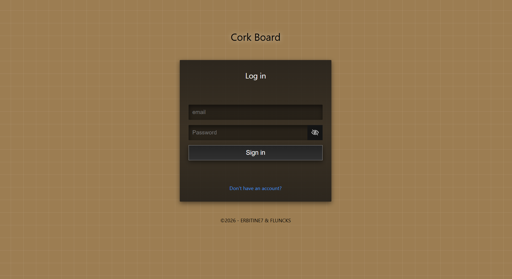
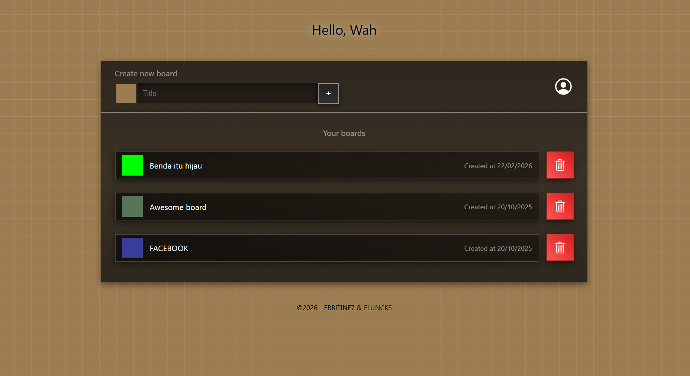
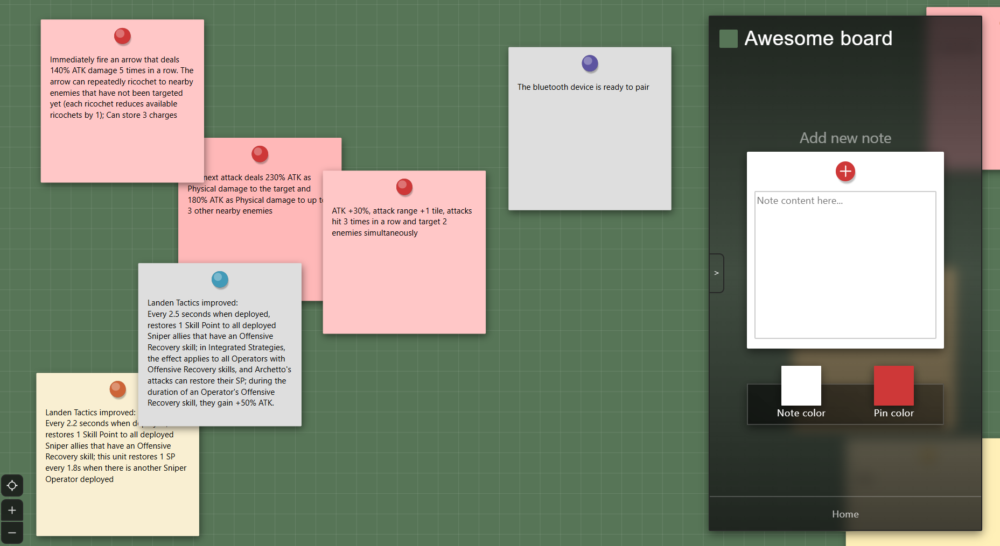

# CorkBoard
A drag and drop cork board website made with HTML, CSS, PHP, and JS
## Features
* Create multiple cork boards
* Text-based notes
* Drag and drop note repositioning
* Recolor boards and notes!
* Autosave
## Tech Stack
* PHP
* MySQL
* JavaScript
* HTML/CSS
* CSS
## How to Run Locally
1. Clone the repository
2. Import the included SQL file into MySQL
3. Configure database credentials in config.php
4. Run using XAMPP or local PHP server
5. Access via http://localhost/CorkBoard/
## Screenshots
* Login Page

* Home Page

* Cork Board

